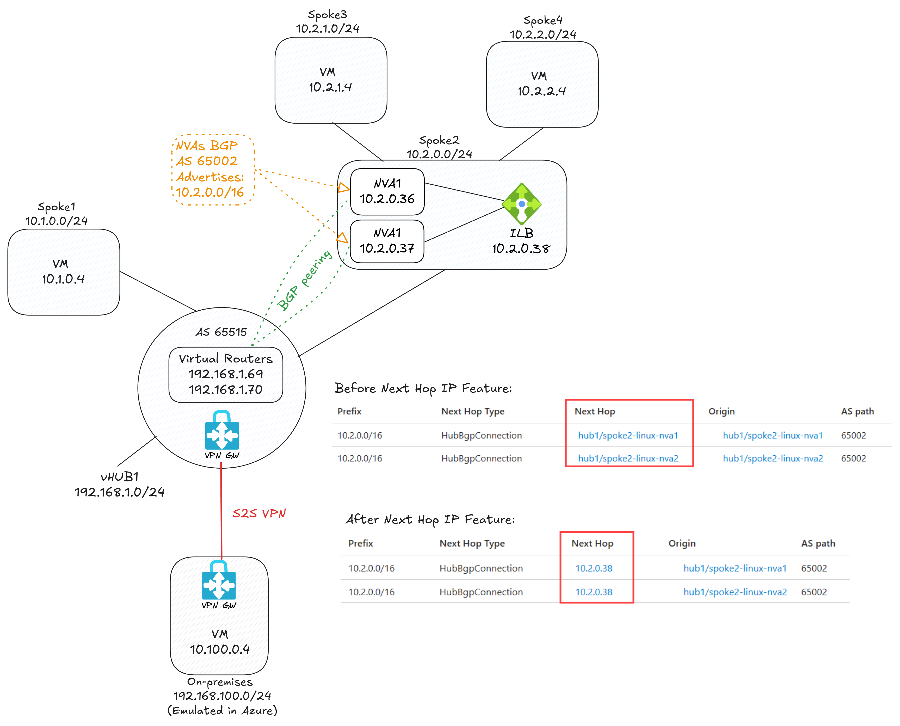
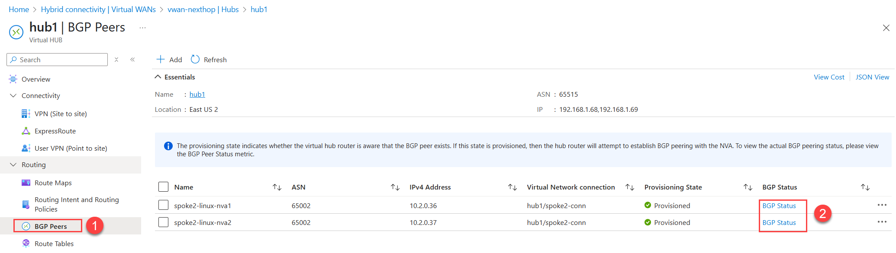
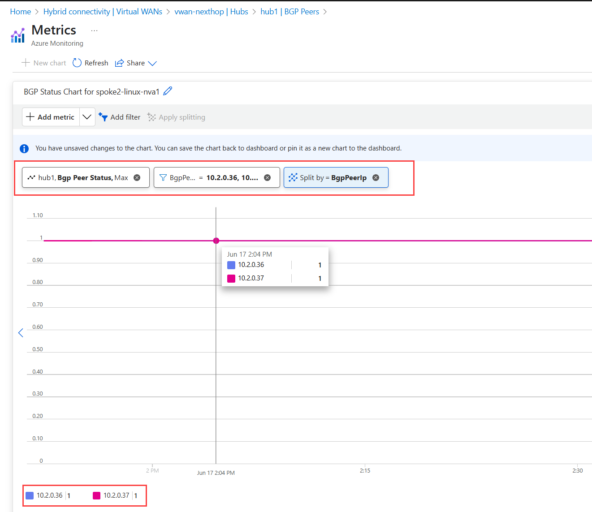

# LAB: Azure Virtual WAN Next Hop IP

## Description
This lab demonstrates how to configure a Next Hop IP in Azure Virtual WAN. It includes the deployment of a Virtual WAN, Virtual Hub, and the necessary configurations to set up a Next Hop IP.

## Prerequisites
- Use [Azure CLI Bash on Linux](https://learn.microsoft.com/en-us/cli/azure/install-azure-cli-linux) or [Azure Cloud Shell CLI Bash](https://shell.azure.com).
- The scripts on this repo does not work in the Azure Cloud Shell PowerShell or CMD.

## Lab Network Diagram



## Deployment Steps

1. Open your Azure CLI Bash and run the following commands to deploy the lab:

```bash
wget -q -O 1deploy.sh https://raw.githubusercontent.com/dmauser/azure-virtualwan-nexthop/refs/heads/main/1deploy.sh
chmod +x 1deploy.sh
./1deploy.sh
```

2. After deployment is completed, run couple validations before Next Hop IP configuration:

    2.1 - Check Virtual WAN Routers BGP status to the NVA instances:

    

    

    2.2 - Log in to the NVA instances spoke2-linux-nva1 and spoke2-linux-nva2 (accessible via Serial Console) and review the BGP peering configuration:
   
    ```bash
    sudo -s
    vtysh 
    show running-config
    show ip bgp
    show ip bgp summary
    show ip bgp neighbors
    show ip bgp neighbors 192.168.1.68 received-routes
    show ip bgp neighbors 192.168.1.68 advertised-routes
    show ip bgp neighbors 192.168.1.69 received-routes
    show ip bgp neighbors 192.168.1.69 advertised-routes
    ```

    2.3 - Check connectivity from spoke1vm and branch1vm to the spoke3vm which is behind the NVAs:
    
    ```bash
    while true; do
      TIMESTAMP=$(date '+%Y-%m-%d %H:%M:%S')
      RESPONSE=$(curl --max-time 5 -s 10.2.1.4)
      if [ $? -eq 0 ]; then
        echo "[$TIMESTAMP] curl succeeded: $RESPONSE"
      else
        echo "[$TIMESTAMP] curl failed or timed out"
      fi
      sleep 5
    done
    ```

    Example of expected output:

    ```bash
    [2025-06-17 21:56:41] curl succeeded: spoke3VM
    [2025-06-17 21:56:46] curl succeeded: spoke3VM
    [2025-06-17 21:56:51] curl succeeded: spoke3VM
    ```

3. On the Azure Cloud Shell run the script below to enable stateful inspection on the NVAs by running the following script:

The script below will enable iptables stateful inspection on the NVAs, you can review what is done by clicking on the link [3enablesfi.sh](https://raw.githubusercontent.com/dmauser/azure-virtualwan-nexthop/refs/heads/main/3enablesfi.sh).

```bash
curl -sL https://raw.githubusercontent.com/dmauser/azure-virtualwan-nexthop/refs/heads/main/3enablesfi.sh | bash
```

4. Revalidate the connectivity from spoke1vm and branch1vm to the spoke3vm:

```bash
while true; do
while true; do
  TIMESTAMP=$(date '+%Y-%m-%d %H:%M:%S')
  RESPONSE=$(curl --max-time 5 -s 10.2.1.4)
  if [ $? -eq 0 ]; then
    echo "[$TIMESTAMP] curl succeeded: $RESPONSE"
  else
    echo "[$TIMESTAMP] curl failed or timed out"
  fi
  sleep 5
done
```

Example of expected output:

```bash
[2025-06-17 21:59:26] curl succeeded: spoke3VM
[2025-06-17 21:59:31] curl succeeded: spoke3VM
[2025-06-17 21:59:36] curl failed or timed out
[2025-06-17 21:59:46] curl failed or timed out
[2025-06-17 21:59:56] curl succeeded: spoke3VM
[2025-06-17 22:00:01] curl failed or timed out
```

Why there are timeout after I enabled stateful inspection on the NVAs?

The timeouts occur because the NVAs are now enforcing stateful inspection, because on the original setup we have direct BGP from both NVAs to the Virtual WAN routers, that will cause BGP ECMP (equal cost multipath) in the traffic which by design BGP behavior.

On the next steps we will enable Next Hop IP on the Virtual WAN, which will now send all traffic to the internal load balancer in front of the NVAs, and that will keep the traffic symmetric and the stateful inspection will work as expected.

5. Enable Next Hop IP on the Virtual WAN by running the following script:

```bash
curl -sL https://raw.githubusercontent.com/dmauser/azure-virtualwan-nexthop/refs/heads/main/4setnexthop.sh | bash
```

6. run couple validations **after** Next Hop IP configuration:

    6.1 - Log in to the NVA instances spoke2-linux-nva1 and spoke2-linux-nva2 (accessible via Serial Console) and review the BGP Next Hop IP configuration:
    ```bash
    sudo -s
    vtysh 
    show running-config
    ```
    Expected output:
    ```bash
    !
    route-map lbnexthop permit 10      <-- This route-map is used to set the next hop IP>
     set ip next-hop 10.2.0.38
    exit
    !
    router bgp 65002
     bgp router-id 10.2.0.36
     no bgp ebgp-requires-policy
     no bgp network import-check
     neighbor 192.168.1.68 remote-as 65515
     neighbor 192.168.1.68 ebgp-multihop
     neighbor 192.168.1.69 remote-as 65515
     neighbor 192.168.1.69 ebgp-multihop
     !
     address-family ipv4 unicast
      network 10.2.0.0/16
      neighbor 192.168.1.68 soft-reconfiguration inbound
      neighbor 192.168.1.68 route-map lbnexthop out       <-- This is the route-map applied to the vHub router 192.168.1.68>
      neighbor 192.168.1.69 soft-reconfiguration inbound
      neighbor 192.168.1.69 route-map lbnexthop out       <-- This is the route-map applied to the vHub router 192.168.1.69>
     exit-address-family
    exit
    !
    ```


  6.2 - Check connectivity from spoke1vm and branch1vm to the spoke3vm which is behind the NVAs:

    ```bash
    while true; do
    while true; do
      TIMESTAMP=$(date '+%Y-%m-%d %H:%M:%S')
      RESPONSE=$(curl --max-time 5 -s 10.2.1.4)
      if [ $? -eq 0 ]; then
        echo "[$TIMESTAMP] curl succeeded: $RESPONSE"
      else
        echo "[$TIMESTAMP] curl failed or timed out"
      fi
      sleep 5
    done
    ```
    Example of expected output transitioning from timeouts to successful responses:

    ```bash
    [2025-06-17 22:43:52] curl succeeded: spoke3VM
    [2025-06-17 22:43:57] curl failed or timed out
    [2025-06-17 22:44:07] curl succeeded: spoke3VM
    [2025-06-17 22:44:12] curl failed or timed out
    [2025-06-17 22:44:22] curl succeeded: spoke3VM
    [2025-06-17 22:44:27] curl succeeded: spoke3VM
    [2025-06-17 22:44:32] curl succeeded: spoke3VM
    [2025-06-17 22:44:37] curl succeeded: spoke3VM
    ```


## Cleanup

To clean up the resources created in this lab, run the following command in your Azure CLI Bash:

```bash
az group delete --name lab-vwan-nexthop --yes --no-wait
```
