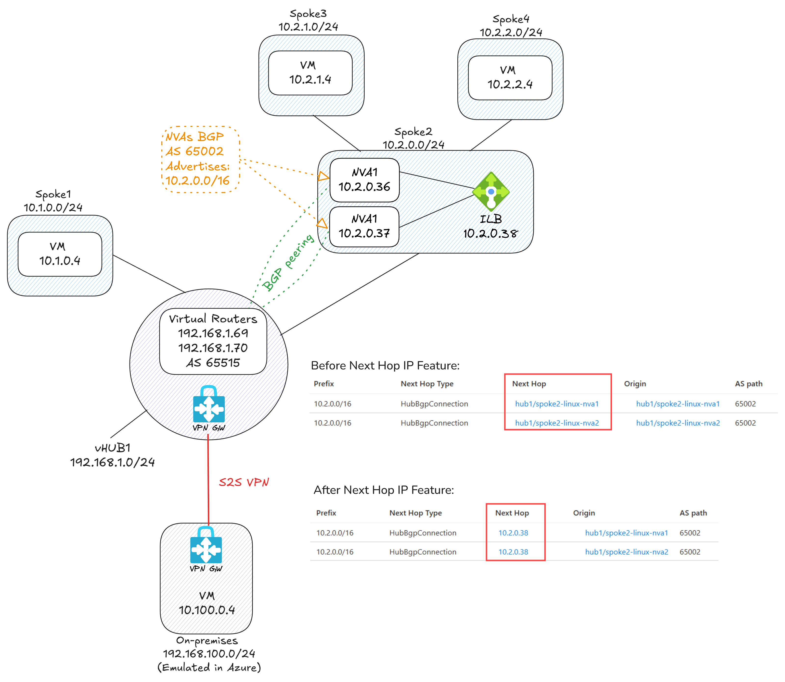

# LAB: Azure Virtual WAN Next Hop IP

## Lab Overview: Configuring Next Hop IP in Azure Virtual WAN

This lab demonstrates how to configure **Next Hop IP** in **Azure Virtual WAN**. It covers the deployment of a **Virtual WAN**, **Virtual Hub**, and the necessary configurations to enable Next Hop IP functionality.

### Objective

The primary goal of this lab is to illustrate the behavior **before and after enabling Next Hop IP** in Azure Virtual WAN. It focuses on the impact this configuration has on **stateful inspection** in **Network Virtual Appliances (NVAs)**, especially when **BGP** is used for routing.

### Key Takeaways

- Understand how traffic symmetry affects stateful inspection.
- Learn how BGP ECMP (Equal-Cost Multi-Path) can disrupt stateful inspection in NVAs.
- See how enabling Next Hop IP routes traffic through an internal load balancer to maintain symmetry.

### Additional Resources

For more information about Next Hop IP support in Azure Virtual WAN, refer to the [official documentation](https:///azure/virtual-wan/next-hop-ip).

## Prerequisites

- Use either the [Azure CLI Bash on Linux](https://learn.microsoft.com/en-usli-linux) or [Azure Cloud Shell Bash](https://shell.azure.com).
- ⚠️ The scripts in this repository **do not work** in Azure Cloud Shell PowerShell or CMD environments.

## Lab Network Diagram



## Deployment Steps

### 1. Open your Azure CLI Bash and run the following commands to deploy the lab:

```bash
wget -q -O 1deploy.sh https://raw.githubusercontent.com/dmauser/azure-virtualwan-nexthop/refs/heads/main/1deploy.sh
chmod +x 1deploy.sh
./1deploy.sh
```

### 2. After deployment is completed, run a few validations before configuring Next Hop IP:

#### 2.1 - Check the Virtual WAN Routers' BGP status with the NVA instances:


#### 2.2 - Review the effective routes in the Virtual Hub using the Azure Portal:


As shown above, the effective routes in the Virtual Hub display the prefix 10.2.0.0/16 set to the NVAs (spoke2-Linux-NVA1 and spoke2-Linux-NVA2). This means that traffic destined for spoke3VM or spoke4VM will be routed through these NVAs and load-shared across both due to BGP ECMP (Equal-Cost Multi-Path) routing.

#### 2.3 - Log in to the NVA instances (spoke2-linux-nva1 and spoke2-linux-nva2, accessible via Serial Console) and review the BGP peering configuration:

```bash
sudo -s
vtysh 
show running-config
show ip bgp
show ip bgp summary
show ip bgp neighbors
show ip bgp neighbors 192.168.1.68 received-routes
show ip bgp neighbors 192.168.1.68 advertised-routes
show ip bgp neighbors 192.168.1.69 received-routes
show ip bgp neighbors 192.168.1.69 advertised-routes
```

#### 2.4 - Check connectivity from spoke1vm and branch1vm to spoke3vm (which is behind the NVAs):

```bash
while true; do
  TIMESTAMP=$(date '+%Y-%m-%d %H:%M:%S')
  RESPONSE=$(curl --max-time 5 -s 10.2.1.4)
  if [ $? -eq 0 ]; then
    echo "[$TIMESTAMP] curl succeeded: $RESPONSE"
  else
    echo "[$TIMESTAMP] curl failed or timed out"
  fi
  sleep 5
done
```
Example of expected output:

```bash
[2025-06-17 21:56:41] curl succeeded: spoke3VM
[2025-06-17 21:56:46] curl succeeded: spoke3VM
[2025-06-17 21:56:51] curl succeeded: spoke3VM
```

### 3. In Azure Cloud Shell, enable stateful inspection on the NVAs by running the following script:

The script below enables iptables stateful inspection on the NVAs. You can review its contents by clicking on the link [3enablesfi.sh](https://raw.githubusercontent.com/dmauser/azure-virtualwan-nexthop/refs/heads/main/3enablesfi.sh).

```bash
curl -sL https://raw.githubusercontent.com/dmauser/azure-virtualwan-nexthop/refs/heads/main/3enablesfi.sh | bash
```

### 4. Revalidate connectivity from spoke1vm and branch1vm to spoke3vm:

```bash
while true; do
  TIMESTAMP=$(date '+%Y-%m-%d %H:%M:%S')
  RESPONSE=$(curl --max-time 5 -s 10.2.1.4)
  if [ $? -eq 0 ]; then
    echo "[$TIMESTAMP] curl succeeded: $RESPONSE"
  else
    echo "[$TIMESTAMP] curl failed or timed out"
  fi
  sleep 5
done
```

Example of expected output:

```bash
[2025-06-17 21:59:26] curl succeeded: spoke3VM
[2025-06-17 21:59:31] curl succeeded: spoke3VM
[2025-06-17 21:59:36] curl failed or timed out
[2025-06-17 21:59:46] curl failed or timed out
[2025-06-17 21:59:56] curl succeeded: spoke3VM
[2025-06-17 22:00:01] curl failed or timed out
```

**Why are there timeouts after enabling stateful inspection on the NVAs?**

The timeouts occur because the NVAs are now enforcing stateful inspection. In the original setup, both NVAs established direct BGP sessions with the Virtual WAN routers. This introduced BGP ECMP (Equal-Cost Multi-Path), causing traffic to be distributed across both NVAs. As a result, return traffic could take a different path than the initial request, breaking the symmetry required for stateful inspection to function correctly.

To resolve this, the next step is to enable the "Next Hop IP" feature on the Virtual WAN. This change routes all traffic through an internal load balancer in front of the NVAs. By doing so, traffic symmetry is preserved, allowing stateful inspection to operate as expected.

### 5. Enable Next Hop IP on the Virtual WAN by running the following script:

```bash
curl -sL https://raw.githubusercontent.com/dmauser/azure-virtualwan-nexthop/refs/heads/main/5setnexthop.sh | bash
```

### 6. Run validations **after** configuring Next Hop IP:

#### 6.1 - Review the effective routes in the Virtual Hub using the Azure Portal:


As shown above, the effective routes in the Virtual Hub now display the prefix 10.2.0.0/16 with the Next Hop IP set to the internal load balancer address (for example, 10.2.0.38) instead of directly to the NVAs. This means all traffic destined for spoke3vm or spoke4vm is routed through the load balancer before reaching the NVAs. Using the Next Hop IP feature is important because it ensures traffic symmetry—both inbound and outbound flows pass through the same NVA instance. This symmetry is critical for stateful inspection to work correctly, as it prevents return traffic from taking a different path and breaking session state.

#### 6.2 - Log in to the NVA instances (spoke2-linux-nva1 and spoke2-linux-nva2, accessible via Serial Console) and review the BGP Next Hop IP configuration:

```bash
sudo -s
vtysh 
show running-config
```
Expected output:
```bash
!
route-map lbnexthop permit 10      <-- This route-map is used to set the next hop IP>
  set ip next-hop 10.2.0.38
exit
!
router bgp 65002
  bgp router-id 10.2.0.36
  no bgp ebgp-requires-policy
  no bgp network import-check
  neighbor 192.168.1.68 remote-as 65515
  neighbor 192.168.1.68 ebgp-multihop
  neighbor 192.168.1.69 remote-as 65515
  neighbor 192.168.1.69 ebgp-multihop
  !
  address-family ipv4 unicast
  network 10.2.0.0/16
  neighbor 192.168.1.68 soft-reconfiguration inbound
  neighbor 192.168.1.68 route-map lbnexthop out       <-- This is the route-map applied to the vHub router 192.168.1.68>
  neighbor 192.168.1.69 soft-reconfiguration inbound
  neighbor 192.168.1.69 route-map lbnexthop out       <-- This is the route-map applied to the vHub router 192.168.1.69>
  exit-address-family
exit
!
```

#### 6.3 - Check connectivity from spoke1vm and branch1vm to spoke3vm (behind the NVAs):

```bash
while true; do
  TIMESTAMP=$(date '+%Y-%m-%d %H:%M:%S')
  RESPONSE=$(curl --max-time 5 -s 10.2.1.4)
  if [ $? -eq 0 ]; then
    echo "[$TIMESTAMP] curl succeeded: $RESPONSE"
  else
    echo "[$TIMESTAMP] curl failed or timed out"
  fi
  sleep 5
done
```

Example of expected output transitioning from timeouts to successful responses:

```bash
[2025-06-17 22:43:52] curl succeeded: spoke3VM
[2025-06-17 22:43:57] curl failed or timed out
[2025-06-17 22:44:07] curl succeeded: spoke3VM
[2025-06-17 22:44:12] curl failed or timed out
[2025-06-17 22:44:22] curl succeeded: spoke3VM
[2025-06-17 22:44:27] curl succeeded: spoke3VM
[2025-06-17 22:44:32] curl succeeded: spoke3VM
[2025-06-17 22:44:37] curl succeeded: spoke3VM
```

### (Optional) Disable Next Hop IP

If you want to disable Next Hop IP, you can run the following script:

```bash
curl -sL https://raw.githubusercontent.com/dmauser/azure-virtualwan-nexthop/refs/heads/main/unset-nexthopip.sh | bash
```

Because stateful inspection is enabled on the NVAs, you will see timeouts again when you run the connectivity test after disabling Next Hop IP.

## Cleanup

To clean up the resources created in this lab, run the following command in your Azure CLI Bash:

```bash
az group delete --name lab-vwan-nexthop --yes --no-wait
```
